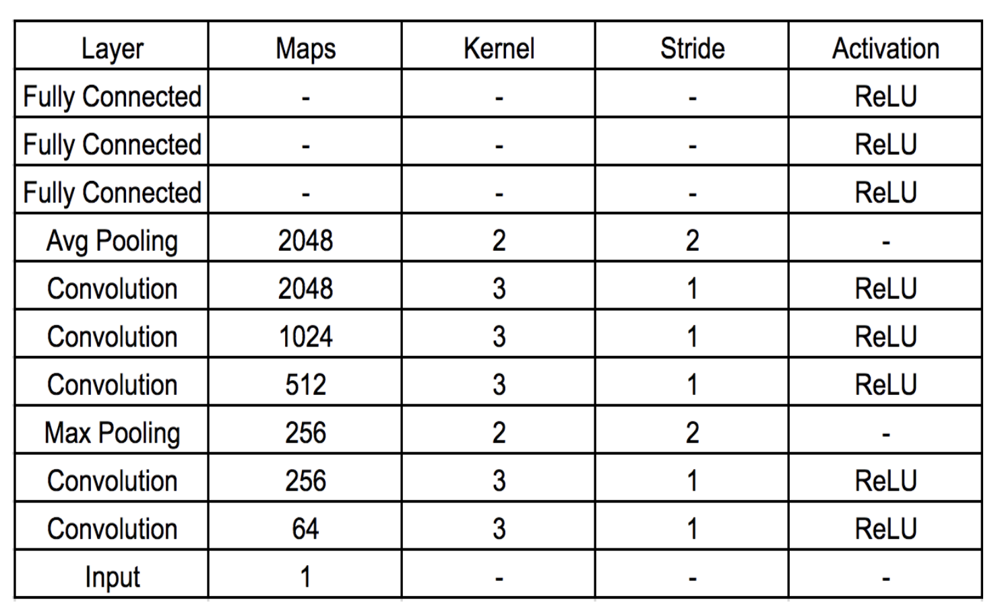
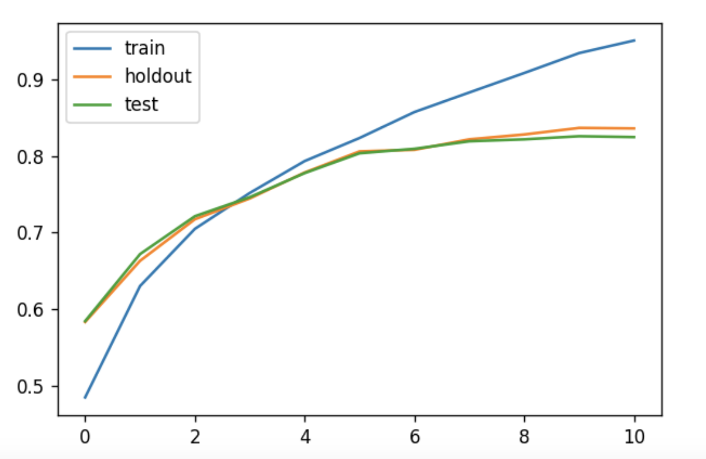
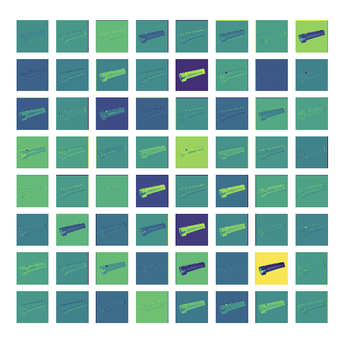
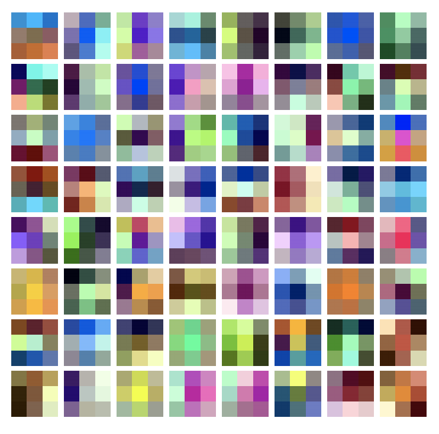

# Using Convolutional Network and Transfer Learning to Classify Images (CIFAR-10)
## Convolutional Network 
* Model Architecture:

* Accuracy Plot:

## Transfer Learning
* Visualizing filters:
Activation after passing through a filter in the first convolution layer

* Visualizing weigths:
Weight visualization of the filters in the first convolution layer

## Acknowledgments:
	This is a class project from UCSD CSE253 Winter 2018
	Ohter team members: Muyun Liu, Zining Wang, Zhipeng Yao
